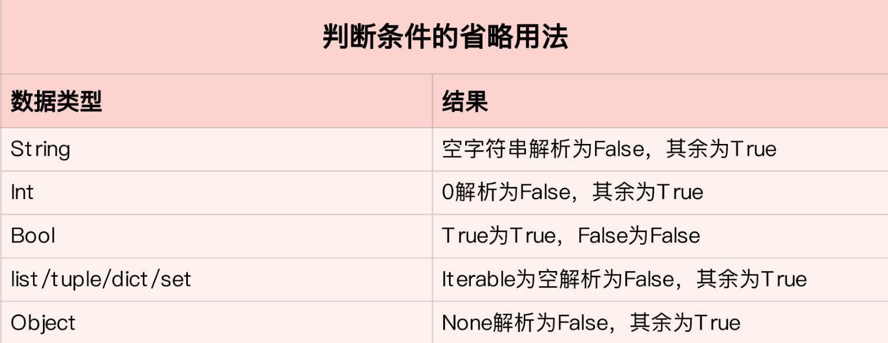

# 简介

学习心得：

- 1、从工程的角度深入理解Python，以实用为出发点，多练习、多阅读、多做项目，这样才能有质的提高。
- 2、牢牢掌握一门编程语言及其学习方法，是日后在所有领域深造的根基。不同语言，需融会贯通。
- 3、基础不牢，地动山摇。更深刻、实质的基础理解，才是更牢固的知识大厦的根基。大厦之基，勤加练习。
- 4、没上过战场开过枪的人，不可能做主官；没有实战经验的语言学习者，不可能成为高手。
- 5、对于Python的源码阅读，主要是CPython，用C写的，可能读起来比较费劲，需要一定的C基础，但是很多时候也不需要详细知道每一句话的意思，大概知道这段干什么就可以了。
- 6、代码规范，必不可少。
- 7、开发经验，质的突破。

特点：

- 1、语言简洁
- 2、开发效率高
- 3、可移植性强
- 4、可以和其他编程语言（比如 C++）轻松无缝衔接


领域：

* 1、机器学习：TensorFlow框架
* 2、人工智能的推荐排序系统与算法
* 3、数据处理
* 4、Web开发
* 5、爬虫
* 6、运维脚本
* 7、数据挖掘（Data Mining）

# 基础


## 列表和元组

相同点：

- 1、列表和元组，都是一个可以放置任意数据类型的有序集合。
> 在绝大多数编程语言中，集合的数据类型必须一致。不过，对于 Python 的列表和元组来说，并无此要求。
- 2、Python 中的列表和元组都支持负数索引，-1 表示最后一个元素，-2 表示倒数第二个元素，以此类推。
- 3、列表和元组都支持切片操作。
- 4、列表和元组都可以随意嵌套。
- 5、两者也可以通过`list()`和`tuple()`函数相互转换

不同点：

- 1、列表是动态的，长度大小不固定，可以随意地增加、删减或者改变元素（mutable）。
- 2、而元组是静态的，长度大小固定，无法增加删减或者改变（immutable）。

```text
count(item) 表示统计列表 / 元组中 item 出现的次数。
index(item) 表示返回列表 / 元组中 item 第一次出现的索引。

list.reverse() 和 list.sort() 分别表示原地倒转列表和排序（注意，元组没有内置的这两个
函数)。

reversed() 和 sorted() 同样表示对列表 / 元组进行倒转和排序，但是会返回一个倒转后
或者排好序的新的列表 / 元组。
```

### 列表和元组存储方式的差异

列表空间分配的过程，为了减小每次增加 / 删减操作时空间分配的开销，Python每次分配空间时都会额外多分配一些，这样的机制（`over-allocating`）保证了其操作的高效性：增加 / 删除的时间复杂度均为 O(1)。

### 列表和元组的性能
结论：**元组要比列表更加轻量级一些，所以总体上来说，元组的性能速度要略优于列表。**

list和tuple的内部实现都是array的形式。

list因为可变，所以是一个over-allocate的array，tuple因为不可变，所以长度大小固定。

具体可以参照源码list:

https://github.com/python/cpython/blob/master/Objects/listobject.c. 

先来看 Python 3.7 的 list 源码。你可以先自己阅读下面两个链接里的内
容。

listobject.h：

https://github.com/python/cpython/blob/949fe976d5c62ae63ed505ecf729f815d0baccfc/Include/listobject.h#L23

listobject.c: 

https://github.com/python/cpython/blob/3d75bd15ac82575967db367c517d7e6e703a6de3/Objects/listobject.c#L33


tuple:

https://github.com/python/cpython/blob/master/Objects/tupleobject.c

下面是 Python 3.7 的 tuple 源码，同样的，你可以
先自己阅读一下。

tupleobject.h： 

https://github.com/python/cpython/blob/3d75bd15ac82575967db367c517d7e6e703a6de3/Include/tupleobject.h#L25

tupleobject.c：

https://github.com/python/cpython/blob/3d75bd15ac82575967db367c517d7e6e703a6de3/Objects/tupleobject.c#L16


创建一个空的列表，可以用下面的 A、B 两种方式，它们在效率上有什么区别吗？应该优先考虑使用哪种呢？
```python
# 创建空列表
# option A
empty_list = list()
# option B
empty_list = []
```
> 区别主要在于list()是一个function call，Python的function call会创建stack，并且进行一系列参
数检查的操作，比较expensive，反观[]是一个内置的C函数，可以直接被调用，因此效率高。

```shell
# 元组的初始化速度，要比列表快 5 倍。
python3 -m timeit 'x=(1,2,3,4,5,6)'
20000000 loops, best of 5: 9.97 nsec per loop
python3 -m timeit 'x=[1,2,3,4,5,6]'
5000000 loops, best of 5: 50.1 nsec per loop

# 索引操作的话，两者的速度差别非常小，几乎可以忽略不计
python3 -m timeit -s 'x=[1,2,3,4,5,6]' 'y=x[3]'
10000000 loops, best of 5: 22.2 nsec per loop
python3 -m timeit -s 'x=(1,2,3,4,5,6)' 'y=x[3]'
10000000 loops, best of 5: 21.9 nsec per loop
```

### 列表（list）

### 元组（tuple）

## 字典和集合

字典是一系列由键（key）和值（value）配对组成的元素的集合。

集合和字典基本相同，唯一的区别，就是集合没有键和值的配对，是一系列无序的、唯一的元素组合。

**Python 中字典和集合，无论是键还是值，都可以是混合类型。**

**集合并不支持索引操作，因为集合本质上是一个哈希表，和列表不一样。**

> 在 Python3.7+，字典被确定为有序（注意：在 3.6 中，字典有序是一个implementation detail，在 3.7 才正式成为语言特性，因此 3.6 中无法 100% 确保其有序性），而 3.6 之前是无序的，其长度大小可变，元素可以任意地删减和改变。

注意：
> 集合的 pop() 操作是删除集合中最后一个元素，可是集合本身是无序的，无法知道会删除哪个元素，因此这个操作得谨慎使用。

对于集合，其排序和前面讲过的列表、元组很类似，直接调用 sorted(set) 即可，结果会返回一个排好序的列表。

### 字典和集合性能

**字典和集合是进行过性能高度优化的数据结构，特别是对于查找、添加和删除操作。**

不同于其他数据结构，字典和集合的内部结构都是一张哈希表。
> 对于字典而言，这张表存储了哈希值（hash）、键和值这 3 个元素。
> 而对集合来说，区别就是哈希表内没有键和值的配对，只有单一的元素了。


初始化字典的方式，哪一种更高效？
```python
# Option A
d = {'name': 'jason', 'age': 20, 'gender': 'male'}
# Option B
d = dict({'name': 'jason', 'age': 20, 'gender': 'male'})
```
> 直接使用大括号更高效，直接调用C函数。

字典的键可以是一个列表吗？下面这段代码中，字典的初始化是否正确呢？
```python
d = {'name': 'jason', ['education']: ['Tsinghua University', 'Stanford University']}
```
> 列表不可以作为key，因为列表是可变类型，可变类型不可hash。


### 字典

哈希冲突（`hash collision`）


### 集合

## 字符串

字符串是由独立字符组成的一个序列，通常包含在单引号（''）双引号（""）或者三引号之中（''' '''或""" """，两者一样）

三引号字符串，则主要应用于多行字符串的情境，比如函数的注释等等。
```python
def calculate_similarity(item1, item2):
    """
    Calculate similarity between two items
    Args:
    item1: 1st item
    item2: 2nd item
    Returns:
    similarity score between item1 and item2
    """
    pass
```

Python 也支持转义字符。


可以把字符串想象成一个由单个字符组成的数组，所以，Python 的字符串同样支持索引，切片和遍历等等操作。

和其他数据结构，如列表、元组一样，字符串的索引同样从 0 开始，index=0 表示第一个元素（字符），[index:index+2] 则表示第 index 个元素到 index+1 个元素组成的子字符串。

**Python 的字符串是不可变的（immutable）。**
```python
s = 'hello'
s[0] = 'H'
Traceback (most recent call last):
File "<stdin>", line 1, in <module>
TypeError: 'str' object does not support item assignment
```

每次想要改变字符串，往往需要 O(n) 的时间复杂度，其中，n 为新字符串的长度。

操作符'+='的字符串拼接方法。是一个例外，打破了字符串不可变的特性。

`str1 += str2 # 表示 str1 = str1 + str2`

自从 Python2.5 开始，每次处理字符串的拼接操作时（str1 += str2），Python 首先会检测 str1 还有没有其他的引用。如果没有的话，就会尝试原地扩充字符串 buffer 的大小，而不是重新分配一块内存来创建新的字符串并拷贝。

```text
字符串内置的 join 函数
`string.join(iterable)，表示把每个元素都按照指定的格式连接起来。`
string.split(str)，分割字符串；
string.strip(str)，表示去掉首尾的 str 字符串；
string.lstrip(str)，表示只去掉开头的 str 字符串；
string.rstrip(str)，表示只去掉尾部的 str 字符串。
string.find(sub, start, end)，表示从start 到 end 查找字符串中子字符串 sub 的位置
```

在新版本的 Python（2.5+）中，下面的两个字符串拼接操作，你觉得哪个更优呢？
```python
s = ''
for n in range(0, 100000):
    s += str(n)

l = []
for n in range(0, 100000):
    l.append(str(n))
s = ' '.join(l)
```
> += 每次都会扩容，而 [] 不会每次扩容
> 如果字符串拼接的次数较少，比如range(100)，那么方法一更优，因为时间复杂度精确的来说第一种是O(n)，第二种是O(2^n)，如果拼接的次数较多，比如range(1000000)，方法二稍快一些，虽然方法二会遍历两次，但是join的速度其实很快，列表append和join的开销要比字符串+=小一些。


### 字符串的格式化

`string.format()`

`%s`

str.format格式相对好一些，但参数多了或者处理更长字符串时还是冗长。
f-string这种方式可以更加简化表达过程。还支持大小写（f.或者F.）

## 输入和输出

### 输入

来自键盘操作

`input()` 函数暂停程序运行，同时等待键盘输入；直到回车被按下，函数的参数即为提示语，输入的类型永远是字符串型（str）。

```python
a = input()
1
b = input()
2
print('a + b = {}'.format(a + b))
########## 输出 ##############
a + b = 12
print('type of a is {}, type of b is {}'.format(type(a), type(b)))
########## 输出 ##############
type of a is <class 'str'>, type of b is <class 'str'>

print('a + b = {}'.format(int(a) + int(b)))
########## 输出 ##############
a + b = 3
```

**Python 对 int 类型没有最大限制**


### 输出


## 条件与循环

Python不支持switch语句



Python中的循环一般通过 for 循环和 while 循环实现。

Python 内置的函数`enumerate()`

```python
expression1 if condition else expression2 for item in iterable
等同：
for item in iterable:
    if condition:
        expression1
    else:
        expression2

如果没有 else 语句，则需要写成：
expression for item in iterable if condition
```

```python
复用并不仅仅局限于一个循环。

比如，给定两个列表 x、y，要求返回 x、y 中所有元素对组成的元祖，相等情况除外。
[(xx, yy) for xx in x for yy in y if xx != yy]
等价于：
l = []
for xx in x:
    for yy in y:
        if xx != yy:
            l.append((xx, yy))
```

```python
attributes = ['name', 'dob', 'gender']
values = [['jason', '2000-01-01', 'male'],
['mike', '1999-01-01', 'male'],
['nancy', '2001-02-01', 'female']
]

s = [dict(zip(attributes,v)) for v in values]
s = [dict(zip(attributes,value)) for value in values if len(attributes)==len(value)]

res=[]
for value in values:
    if len(attributes)!=len(value):
        continue
    temp={}
    for index,each in enumerate(value):
        temp[attributes[index]]=each
    res.append(temp)
print(res)

# expected outout:
[{'name': 'jason', 'dob': '2000-01-01', 'gender': 'male'},
{'name': 'mike', 'dob': '1999-01-01', 'gender': 'male'},
{'name': 'nancy', 'dob': '2001-02-01', 'gender': 'female'}]
```

## 异常处理

错误和异常

> 异常，通常是指程序运行的过程中遇到了错误，终止并退出。
> 我们通常使用 try except语句去处理异常，这样程序就不会被终止，仍能继续执行。


[异常doc](https://docs.python.org/3/library/exceptions.html#bltin-exceptions)

```python
try:
    s = input('please enter two numbers separated by comma: ')
    num1 = int(s.split(',')[0].strip())
    num2 = int(s.split(',')[1].strip())
    ...
except (ValueError, IndexError) as err:
    print('Error: {}'.format(err))
    print('continue')

或者：
try:
    s = input('please enter two numbers separated by comma: ')
    num1 = int(s.split(',')[0].strip())
    num2 = int(s.split(',')[1].strip())
    ...
except ValueError as err:
    print('Error: {}'.format(err))
    print('continue')
except IndexError as err:
    print('Error: {}'.format(err))
    print('continue')
# Exception 是其他所有非系统异常的基类，能够匹配任意非系统异常。
except Exception as err:
    print('Other error: {}'.format(err))
# 在 except 后面省略异常类型，这表示与任意异常相匹配（包括系统异常等）
except:
    print('Other error')
```

### 自定义异常
```python
class MyInputError(Exception):
    """Exception raised when there're errors in input"""
    def __init__(self, value): # 自定义异常类型的初始化
        self.value = value
    def __str__(self): # 自定义异常类型的 string 表达形式
        return ("{} is invalid input".format(repr(self.value)))
try:
    raise MyInputError(1) # 抛出 MyInputError 这个异常
except MyInputError as err:
    print('error: {}'.format(err))
```

```python
e = 1
try:
    1/0
except ZeroDivisionError as e:
    pass

print(e) # NameError: name 'e' is not defined
```

查阅官方文档，会看到这么一句话`When an exception has been assigned using as target, it is cleared at the end of the except clause. `

如果你在异常处理的 except block 中，把异常赋予了一个变量，那么这个变量会在 except block 执行结束时被删除。相当于下面这样的表示：
```python
e = 1
try:
    1/0
except ZeroDivisionError as e:
    try:
        pass
    finally:
        del e
```

如果全局变量指向的对象是可变的，比如是列表、字典等等，你就可以在函数内部修改它了。
```python
x = [1]
def func():
    x.append(2)

func()
print(x) # [1, 2]

x = 1
def func():
    # 程序默认函数内部的 x 是局部变量，而你没有为其赋值就直接引用，显然是不可行。
    x += 1

func() # UnboundLocalError: local variable 'x' referenced before assignment
```

## 函数

> def 是可执行语句，这意味着函数直到被调用前，都是不存在的。
> 当程序调用函数时，def 语句才会创建一个新的函数对象，并赋予其名字。

> Python 是 dynamically typed 的，可以接受任何数据类型（整型，浮点，字符串等等）。
> 对函数参数来说，这一点同样适用。

```python
def name(param1, param2, ..., paramN):
    statements
    return/yield value # optional
```

```python
def find_largest_element(l):
    if not isinstance(l, list):
        print('input is not type of list')
        return
    if len(l) == 0:
        print('empty input')
        return
    largest_element = l[0]
    for item in l:
        if item > largest_element:
            largest_element = item
    print('largest element is: {}'.format(largest_element))

find_largest_element([8, 1,-3, 2, 0])
# 输出
# largest element is: 8
```

函数的嵌套能够保证内部函数的隐私。
> 内部函数只能被外部函数所调用和访问，不会暴露在全局作用域，因此，如果你的函数内部有一些隐私数据（比如数据库的用户、密码等），不想暴露在外，那你就可以使用函数的的嵌套，将其封装在内部函数中，只通过外部函数来访问。

```python
def connect_DB():
    def get_DB_configuration():
        ...
        return host, username, password
    conn = connector.connect(get_DB_configuration())
    return conn
```

函数内修改全局变量
```python
MIN_VALUE = 1
MAX_VALUE = 10
def validation_check(value):
    global MIN_VALUE
    ...
    MIN_VALUE += 1
    ...
# 调用
validation_check(5)
```

> global 关键字，并不表示重新创建了一个全局变量 MIN_VALUE，而是告诉Python 解释器，函数内部的变量 MIN_VALUE，就是之前定义的全局变量，并不是新的全局变量，也不是局部变量。
> 这样，程序就可以在函数内部访问全局变量，并修改它的值了。

对于嵌套函数来说，内部函数可以访问外部函数定义的变量，但是无法修改，若要修改，必须加上 nonlocal 这个关键字。

```python
def outer():
    x = "local"
def inner():
    nonlocal x # nonlocal 关键字表示这里的 x 就是外部函数 outer 定义的变量 x
    x = 'nonlocal'
    print("inner:", x)
    inner()
    print("outer:", x)

outer()
# 输出
inner: nonlocal
outer: nonlocal
```

### 闭包(closure)

> 和嵌套函数优点类似，函数开头需要做一些额外工作，而你又需要多次调用这个函数时，将那些额外工作的代码放在外部函数，就可以减少多次调用导致的不必要的开销，提高程序的运行效率。
> 闭包常常和装饰器（decorator）一起使用。

```python
def nth_power(exponent):
    def exponent_of(base):
        return base ** exponent
    return exponent_of # 返回值是 exponent_of 函数

square = nth_power(2) # 计算一个数的平方
cube = nth_power(3) # 计算一个数的立方

square
# 输出
<function __main__.nth_power.<locals>.exponent(base)>

cube
# 输出
<function __main__.nth_power.<locals>.exponent(base)>

print(square(2)) # 计算 2 的平方
print(cube(2)) # 计算 2 的立方
# 输出
4 # 2^2
8 # 2^3
```

[参考](https://zhuanlan.zhihu.com/p/26934085)

什么是闭包？闭包有什么用？为什么要用闭包？

首先，Python函数是第一类对象。闭包和函数紧密联系在一起。

介绍闭包前有必要先介绍一些背景知识，诸如嵌套函数、变量的作用域等概念。

作用域
> 作用域是程序运行时变量可被访问的范围，定义在函数内的变量是局部变量，局部变量的作用范围只能是函数内部范围内，它不能在函数外引用。

定义在模块最外层的变量是全局变量，它是全局范围内可见的，当然在函数里面也可以读取到全局变量的。例如：
```python
num = 10 # 全局作用域变量
def foo():
    print(num)  # 10
```

而在函数外部则不可以访问局部变量。例如：
```python
def foo():
    num = 10
print(num)  # NameError: name 'num' is not defined
```

嵌套函数
> 函数不仅可以定义在模块的最外层，还可以定义在另外一个函数的内部，像这种定义在函数里面的函数称之为嵌套函数（nested function）

例如：
```python
def print_msg():
    # print_msg 是外围函数
    msg = "zen of python"

    def printer():
        # printer是嵌套函数
        print(msg)
    printer()
# 输出 zen of python
print_msg()
```

对于嵌套函数，它可以访问到其外层作用域中声明的非局部（non-local）变量，比如代码示例中的变量 msg 可以被嵌套函数 printer 正常访问。

那么有没有一种可能即使脱离了函数本身的作用范围，局部变量还可以被访问得到呢？答案是闭包。

什么是闭包
> 函数身为第一类对象，它可以作为函数的返回值返回。

如下的例子：
```python
def print_msg():
    # print_msg 是外围函数
    msg = "zen of python"
    def printer():
        # printer 是嵌套函数
        print(msg)
    return printer

another = print_msg()
# 输出 zen of python
another()
```

这段代码和前面例子的效果完全一样，同样输出 "zen of python"。不同的地方在于内部函数 printer 直接作为返回值返回了。

一般情况下，函数中的局部变量仅在函数的执行期间可用，一旦 print_msg() 执行过后，我们会认为 msg变量将不再可用。

然而，在这里我们发现 print_msg 执行完之后，在调用 another 的时候 msg 变量的值正常输出了，这就是闭包的作用，闭包使得局部变量在函数外被访问成为可能。

看完这个例子，我们再来定义闭包，维基百科上的解释是:
> 在计算机科学中，闭包（Closure）是词法闭包（Lexical Closure）的简称，是引用了自由变量的函数。
> 这个被引用的自由变量将和这个函数一同存在，即使已经离开了创造它的环境也不例外。
> 所以，有另一种说法认为闭包是由函数和与其相关的引用环境组合而成的实体。

这里的 another 就是一个闭包，闭包本质上是一个函数，它有两部分组成，printer 函数和变量 msg。闭包使得这些变量的值始终保存在内存中。

闭包，顾名思义，就是一个封闭的包裹，里面包裹着自由变量，就像在类里面定义的属性值一样，自由变量的可见范围随同包裹，哪里可以访问到这个包裹，哪里就可以访问到这个自由变量。

为什么要使用闭包
> 闭包避免了使用全局变量，此外，闭包允许将函数与其所操作的某些数据（环境）关连起来。
> 这一点与面向对象编程是非常类似的，在面对象编程中，对象允许我们将某些数据（对象的属性）与一个或者多个方法相关联。

一般来说，当对象中只有一个方法时，这时使用闭包是更好的选择。来看一个例子：
```python
def adder(x):
    def wrapper(y):
        return x + y
    return wrapper

adder5 = adder(5)
# 输出 15
adder5(10)
# 输出 11
adder5(6)
```
这比用类来实现更优雅，此外装饰器也是基于闭包的一中应用场景。

所有函数都有一个 __closure__属性，如果这个函数是一个闭包的话，那么它返回的是一个由 cell 对象 组成的元组对象。

cell 对象的cell_contents 属性就是闭包中的自由变量。

```shell
>>> adder.__closure__
>>> adder5.__closure__
(<cell at 0x103075910: int object at 0x7fd251604518>,)
>>> adder5.__closure__[0].cell_contents
5
```

这解释了为什么局部变量脱离函数之后，还可以在函数之外被访问的原因的，因为它存储在了闭包的cell_contents中了。

## 匿名函数(lambda)

格式：
`lambda argument1, argument2,... argumentN : expression`

lambda 是一个表达式（expression），并不是一个语句（statement）。

lambda 的主体是只有一行的简单表达式，并不能扩展成一个多行的代码块。

Python 之所以发明 lambda，就是为了让它和常规函数各司其职：lambda 专注于简单的任务，而常规函数则负责更复杂的多行逻辑。（[python之父的解释](https://www.artima.com/weblogs/viewpost.jsp?thread=147358)）

匿名函数通常的使用场景是：程序中需要使用一个函数完成一个简单的功能，并且该函数只调用一次。


在一些情况下，使用匿名函数 lambda，可以帮助我们大大简化代码的复杂度，提高代码的可读性。

```python
对一个列表中的所有元素做平方操作
squared = map(lambda x: x**2, [1, 2, 3, 4, 5])

def square(x):
    return x**2
squared = map(square, [1, 2, 3, 4, 5])
```

lambda 可以用在列表内部，而常规函数却不能
```python
[(lambda x: x*x)(x) for x in range(10)]
# 输出
[0, 1, 4, 9, 16, 25, 36, 49, 64, 81]
```

lambda 可以被用作某些函数的参数，而常规函数 def 也不能
```python
l = [(1, 20), (3, 0), (9, 10), (2, -1)]
l.sort(key=lambda x: x[1]) # 按列表中元祖的第二个元素排序
print(l)
# 输出
[(2, -1), (3, 0), (9, 10), (1, 20)]
```

```python
# 对一个字典，根据值进行由高到底的排序
d = {'mike': 10, 'lucy': 2, 'ben': 30}
sorted(d.item(), key = lambda x: x[1], reverse = True)
```


Python 函数式编程
> Python 的函数式编程特性，与匿名函数lambda，有着密切的联系。
> 所谓函数式编程，是指代码中每一块都是不可变的（immutable），都由纯函数（pure function）的形式组成。
> 这里的纯函数，是指函数本身相互独立、互不影响，对于相同的输入，总会有相同的输出，没有任何副作用。

> 函数式编程的优点，主要在于其纯函数和不可变的特性使程序更加健壮，易于调试（debug）和测试；
> 缺点主要在于限制多，难写。当然，Python 不同于一些语言（比如Scala），它并不是一门函数式编程语言。
> 不过，Python 也提供了一些函数式编程的特性，值得我们了解和学习。

Python 主要提供了这么几个函数：map()、filter() 和 reduce()，通常结合匿名函数lambda 一起使用。


函数 map(function, iterable) 的第一个参数是函数对象，第二个参数是一个可以遍历的集合，它表示对iterable 的每一个元素，都运用 function 这个函数，最后返回一个新的可遍历的集合。
```python
l = [1, 2, 3, 4, 5]
new_list = map(lambda x: x * 2, l) # [2， 4， 6， 8， 10]
```

性能对比：
```shell
# lambda
python3 -mtimeit -s'xs=range(1000000)' 'map(lambda x: x*2, xs)'
2000000 loops, best of 5: 171 nsec per loop

# list comprehension
python3 -mtimeit -s'xs=range(1000000)' '[x * 2 for x in xs]'
5 loops, best of 5: 62.9 msec per loop

# 常规
python3 -mtimeit -s'xs=range(1000000)' 'l = []' 'for i in xs: l.append(i * 2)'
5 loops, best of 5: 92.7 msec per loop
```
可以看到，map() 是最快的。因为 map() 函数直接由 C 语言写的，运行时不需要通过Python 解释器间接调用，并且内部做了诸多优化，所以运行速度最快。

filter(function, iterable) 函数，它和 map 函数类似，function 同样表示一个函数对象。filter() 函数表示对 iterable 中的每个元素，都使用 function 判断，并返回True 或者 False，最后将返回 True 的元素组成一个新的可遍历的集合。
```python
l = [1, 2, 3, 4, 5]
new_list = filter(lambda x: x % 2 == 0, l) # [2, 4]
```

reduce(function, iterable) 函数，它通常用来对一个集合做一些累积操作。function 同样是一个函数对象，规定它有两个参数，表示对 iterable 中的每个元素以及上一次调用后的结果，运用 function 进行计算，所以最后返回的是一个单独的数值。
```python
from functools import reduce
# 计算某个列表元素的乘积
l = [1, 2, 3, 4, 5]
product = reduce(lambda x, y: x * y, l) # 1*2*3*4*5 = 120
```

类似的，filter() 和 reduce() 的功能，也可以用 for 循环或者 list comprehension来实现。

## 类（面向对象OOM）

类，一群有着相同属性和函数的对象的集合。

`OOP (object oriented programming)`

```python
def __init__(self, title, author, context):
    # 表示构造函数，意即一个对象生成时会被自动调用的函数。
    pass
```

如果一个属性以 __ （注意，此处有两个 _） 开头，我们就默认这个属性是私有属性。

类函数的第一个参数一般为 cls，表示必须传一个类进来。类函数最常用的功能是实现不同的 init 构造函数.

类函数需要装饰器 @classmethod 来声明。

每个类都有构造函数，继承类在生成对象的时候，是不会自动调用父类的构造函数的，因此你必须在 init() 函数中显式调用父类的构造函数。它们的执行顺序是 子类的构造函数 -> 父类的构造函数。

问题：多重继承
> 多重继承，是基于mro进行查找，使用的是一种C3的算法。
> 可以通过 xxx.__mro__ 查看继承的顺序

多重继承有两种初始化方法：
> 第一种，super(BOWInvertedIndexEngineWithCache, self).__init__()直接初始化该类的第一个父类，不过使用这种方法时，要求继承链的最顶层父类必须要继承object；
> 第二种，对于多重继承，如果有多个构造函数需要调用， 我们就必须用传统的方法LRUCache.__init__(self) 。


菱形继承问题？
> 菱形继承潜在的问题：一个基类的初始化函数可能被调用两次。
> 在一般的工程中，这显然不是我们所希望的。正确的做法应该是使用 super 来召唤父类的构造函数，而且python 使用一种叫做方法解析顺序的算法（具体实现算法叫做 C3），来保证一个类只会被初始化一次。

私有变量能被继承吗？如果不能，你想继承应该怎么去做呢？
> Python是没有严格的private变量的。子类确实无法直接访问父类"self.__var"变量。
> 子类不能继承父类私有属性，只可透过self._Parent__varname去读取该私有属性的值。
> 或在父类创建方法返回私有属性的值，然后子类调用父类方法去取得该私有属性的值。


### 抽象函数和抽象类

抽象类是一种特殊的类，它生下来就是作为父类存在的，一旦对象化就会报错。

同样，抽象函数定义在抽象类之中，子类必须重写该函数才能使用。

相应的抽象函数，则是使用装饰器@abstractmethod 来表示。

## 模块化

`from your_file import function_name, class_name`的方式调用

在 Facebook 的编程规范中，除了一些极其特殊的情况，import 必须位于程序的最前端。

还需要在模块所在的文件夹新建一个 __init__.py，内容可以为空，也可以用来表述包对外暴露的模块接口。

不过，事实上，这是 Python 2 的规范。在 Python 3 规范中，__init__.py 并不是必须的。

通常，一个 Python 文件在运行的时候，都会有一个运行时位置，最开始时即为这个文件所在的文件夹。

当然，这个运行路径以后可以被改变。

运行 sys.path.append("..") ，则可以改变当前 Python 解释器的位置。

不过，一般而言我并不推荐，固定一个确定路径对大型工程来说是非常必要的。

首先，你会发现，相对位置是一种很不好的选择。

因为代码可能会迁移，相对位置会使得重构既不雅观，也易出错。

因此，在大型工程中尽可能使用绝对位置是第一要义。

对于一个独立的项目，所有的模块的追寻方式，最好从项目的根目录开始追溯，这叫做相对的绝对路径。

如果你有兴趣，可以参考这篇论文：

https://cacm.acm.org/magazines/2016/7/204032-why-google-stores-billions-of-lines-of-code-in-a-single-repository/fulltext

**以项目的根目录作为最基本的目录，所有的模块调用，都要通过根目录一层层向下索引的方式来 import**

实际上，Python 解释器在遇到 import 的时候，它会在一个特定的列表中寻找模块。

这个特定的列表，可以用下面的方式拿到：
```python
import sys
print(sys.path)

########## 输出 ##########
# ['', '/usr/lib/python36.zip', '/usr/lib/python3.6', '/usr/lib/python3.6/lib-dynload' ...]
```

请注意，它的第一项为空。

其实，Pycharm 做的一件事，就是将第一项设置为项目根目录的绝对地址。

这样，每次你无论怎么运行 main.py，import 函数在执行的时候，都会去项目根目录中找相应的包。

有2种方式：

1、
```python
import sys
sys.path[0] = '/home/ubuntu/workspace/your_projects'
```

2、
是修改 PYTHONHOME。
Python 的 Virtual Environment（虚拟运行环境）。

在一个 Virtual Environment 里，你能找到一个文件叫activate，在这个文件的末尾，填上下面的内容：
`export PYTHONPATH="/home/ubuntu/workspace/your_projects"`

Python 可以通过 Virtualenv 工具，非常方便地创建一个全新的 Python 运行环境。

这样，每次你通过 activate 激活这个运行时环境的时候，它就会自动将项目的根目录添加到搜索路径中去。

神奇的 `if __name__ == '__main__'`

Python 是脚本语言，和 C++、Java 最大的不同在于，不需要显式提供 main() 函数入口。

import 在导入文件的时候，会自动把所有暴露在外面的代码全都执行一遍。

因此，如果你要把一个东西封装成模块，又想让它可以执行的话，你必须将要执行的代码放在 if__name__ == '__main__'下面。


为什么呢？

其实，__name__ 作为 Python 的魔术内置参数，本质上是模块对象的一个属性。

我们使用 import 语句时，__name__ 就会被赋值为该模块的名字，自然就不等于__main__了。


# 进阶

## 对象的比较、拷贝

`'==' VS 'is'`

等于（==）和 is 是 Python 中对象比较常用的两种方式。简单来说，'=='操作符比较对象之间的值是否相等。

而'is'操作符比较的是对象的身份标识是否相等，即它们是否是同一个对象，是否指向同一个内存地址。

在 Python 中，每个对象的身份标识，都能通过函数 id(object) 获得。因此，'is'操作符，相当于比较对象之间的 ID 是否相等。

```python
a = 10
b = 10
 
a == b
True
 
id(a)
4427562448
id(b)
4427562448
 
a is b
True
```

这里，首先 Python 会为 10 这个值开辟一块内存，然后变量 a 和 b 同时指向这块内存区域，即 a 和 b 都是指向 10 这个变量，因此 a 和 b 的值相等，id 也相等，a == b和a is b都返回 True。

不过，需要注意，对于整型数字来说，以上a is b为 True 的结论，只适用于 -5 到 256 范围内的数字。

```python
a = 257
b = 257
 
a == b
True

id(a)
4473417552 
id(b)
4473417584
 
a is b
False
```

事实上，出于对性能优化的考虑，Python 内部会对 -5 到 256 的整型维持一个数组，起到一个缓存的作用。

这样，每次你试图创建一个 -5 到 256 范围内的整型数字时，Python 都会从这个数组中返回相对应的引用，而不是重新开辟一块新的内存空间。

但是，如果整型数字超过了这个范围，比如上述例子中的 257，Python 则会为两个 257 开辟两块内存区域，因此 a 和 b 的 ID 不一样，a is b就会返回 False 了。

通常来说，在实际工作中，当我们比较变量时，使用'=='的次数会比'is'多得多，因为我们一般更关心两个变量的值，而不是它们内部的存储地址。

但是，当我们比较一个变量与一个单例（singleton）时，通常会使用'is'。一个典型的例子，就是检查一个变量是否为 None：

```python
if a is None:
    pass 
if a is not None:
    pass
```

注意，比较操作符'is'的速度效率，通常要优于'=='。

因为'is'操作符不能被重载，这样，Python 就不需要去寻找，程序中是否有其他地方重载了比较操作符，并去调用。执行比较操作符'is'，就仅仅是比较两个变量的 ID 而已。

但是'=='操作符却不同，执行a == b相当于是去执行`a.__eq__(b)`，而 Python 大部分的数据类型都会去重载__eq__这个函数，其内部的处理通常会复杂一些。

比如，对于列表，__eq__函数会去遍历列表中的元素，比较它们的顺序和值是否相等。

不过，对于不可变（immutable）的变量，如果我们之前用'=='或者'is'比较过，结果是不是就一直不变了呢？
答案自然是否定的。

```python
t1 = (1, 2, [3, 4])
t2 = (1, 2, [3, 4])
t1 == t2
True
 
t1[-1].append(5)
t1 == t2
False
```

我们知道元组是不可变的，但元组可以嵌套，它里面的元素可以是列表类型，列表是可变的，所以如果我们修改了元组中的某个可变元素，那么元组本身也就改变了，之前用'is'或者'=='操作符取得的结果，可能就不适用了。

浅拷贝（shallow copy）和深度拷贝（deep copy）

常见的浅拷贝的方法，是使用数据类型本身的构造器
```python
l1 = [1, 2, 3]
l2 = list(l1)
l2
[1, 2, 3]

l1 == l2
True
 
l1 is l2
False
 
s1 = set([1, 2, 3])
s2 = set(s1)
s2
{1, 2, 3}

s1 == s2
True

s1 is s2
False
```

这里，l2 就是 l1 的浅拷贝，s2 是 s1 的浅拷贝。当然，对于可变的序列，我们还可以通过切片操作符':'完成浅拷贝:
```python
l1 = [1, 2, 3]
l2 = l1[:]
 
l1 == l2
True
 
l1 is l2
False
```

当然，Python 中也提供了相对应的函数 copy.copy()，适用于任何数据类型：
```python
import copy
l1 = [1, 2, 3]
l2 = copy.copy(l1)
```

不过，需要注意的是，对于元组，使用 tuple() 或者切片操作符':'不会创建一份浅拷贝，相反，它会返回一个指向相同元组的引用：
```python
t1 = (1, 2, 3)
t2 = tuple(t1)
 
t1 == t2
True
 
t1 is t2
True
```
这里，元组 (1, 2, 3) 只被创建一次，t1 和 t2 同时指向这个元组。

**浅拷贝，是指重新分配一块内存，创建一个新的对象，里面的元素是原对象中子对象的引用。**

因此，如果原对象中的元素不可变，那倒无所谓；但如果元素可变，浅拷贝通常会带来一些副作用，尤其需要注意。

```python
l1 = [[1, 2], (30, 40)]
l2 = list(l1)
l1.append(100)
l1[0].append(3)
 
l1
[[1, 2, 3], (30, 40), 100]
 
l2
[[1, 2, 3], (30, 40)]
 
l1[1] += (50, 60)
l1
[[1, 2, 3], (30, 40, 50, 60), 100]
 
l2
[[1, 2, 3], (30, 40)]
```

首先初始化了一个列表 l1，里面的元素是一个列表和一个元组；然后对 l1 执行浅拷贝，赋予 l2。因为浅拷贝里的元素是对原对象元素的引用，因此 l2 中的元素和 l1 指向同一个列表和元组对象。

接着往下看。l1.append(100)，表示对 l1 的列表新增元素 100。这个操作不会对 l2 产生任何影响，因为 l2 和 l1 作为整体是两个不同的对象，并不共享内存地址。操作过后 l2 不变，l1 会发生改变。

l1[0].append(3)，这里表示对 l1 中的第一个列表新增元素 3。因为 l2 是 l1 的浅拷贝，l2 中的第一个元素和 l1 中的第一个元素，共同指向同一个列表，因此 l2 中的第一个列表也会相对应的新增元素 3。操作后 l1 和 l2 都会改变。

最后是l1[1] += (50, 60)，因为元组是不可变的，这里表示对 l1 中的第二个元组拼接，然后重新创建了一个新元组作为 l1 中的第二个元素，而 l2 中没有引用新元组，因此 l2 并不受影响。操作后 l2 不变，l1 发生改变。

**深度拷贝，是指重新分配一块内存，创建一个新的对象，并且将原对象中的元素，以递归的方式，通过创建新的子对象拷贝到新对象中。因此，新对象和原对象没有任何关联。**

Python 中以 copy.deepcopy() 来实现对象的深度拷贝。比如上述例子写成下面的形式，就是深度拷贝：
```python
import copy
l1 = [[1, 2], (30, 40)]
l2 = copy.deepcopy(l1)
l1.append(100)
l1[0].append(3)
 
l1
[[1, 2, 3], (30, 40), 100]
 
l2 
[[1, 2], (30, 40)]
```

可以看到，无论 l1 如何变化，l2 都不变。因为此时的 l1 和 l2 完全独立，没有任何联系。

不过，深度拷贝也不是完美的，往往也会带来一系列问题。如果被拷贝对象中存在指向自身的引用，那么程序很容易陷入无限循环：
```python
import copy
x = [1]
x.append(x)

x
[1, [...]]
 
y = copy.deepcopy(x)
y
[1, [...]]
```
上面这个例子，列表 x 中有指向自身的引用，因此 x 是一个无限嵌套的列表。但是我们发现深度拷贝 x 到 y 后，程序并没有出现 stack overflow 的现象。这是为什么呢？

其实，这是因为深度拷贝函数 deepcopy 中会维护一个字典，记录已经拷贝的对象与其 ID。

拷贝过程中，如果字典里已经存储了将要拷贝的对象，则会从字典直接返回，我们来看相对应的源码就能明白：
```python
def deepcopy(x, memo=None, _nil=[]):
    """Deep copy operation on arbitrary Python objects.
    	
	See the module's __doc__ string for more info.
	"""
	
    if memo is None:
        memo = {}
    d = id(x) # 查询被拷贝对象 x 的 id
	y = memo.get(d, _nil) # 查询字典里是否已经存储了该对象
	if y is not _nil:
	    return y # 如果字典里已经存储了将要拷贝的对象，则直接返回
        ...    
```

总结：

1、比较操作符'=='表示比较对象间的值是否相等，而'is'表示比较对象的标识是否相等，即它们是否指向同一个内存地址。

2、比较操作符'is'效率优于'=='，因为'is'操作符无法被重载，执行'is'操作只是简单的获取对象的 ID，并进行比较；而'=='操作符则会递归地遍历对象的所有值，并逐一比较。

3、浅拷贝中的元素，是原对象中子对象的引用，因此，如果原对象中的元素是可变的，改变其也会影响拷贝后的对象，存在一定的副作用。

4、深度拷贝则会递归地拷贝原对象中的每一个子对象，因此拷贝后的对象和原对象互不相关。另外，深度拷贝中会维护一个字典，记录已经拷贝的对象及其 ID，来提高效率并防止无限递归的发生。


思考题
```python
import copy
x = [1]
x.append(x)
 
y = copy.deepcopy(x)
 
# 以下命令的输出是？
x == y
```
运行代码时报错。原因是进行"=="时需要递归对比每一个元素，该循环是一个无限循环（无限个元素）。然而python专门设置的一种机制用来防止无限递归造成Python溢出崩溃，换句话说不能遍历比较到所有值，所以报错“RecursionError: maximum recursion depth exceeded in comparison”

## Python里参数是如何传递的

**值传递，通常就是拷贝参数的值，然后传递给函数里的新变量。这样，原变量和新变量之间互相独立，互不影响。**

**引用传递，通常是指把参数的引用传给新的变量，这样，原变量和新变量就会指向同一块内存地址。如果改变了其中任何一个变量的值，那么另外一个变量也会相应地随之改变。**

基本的变量赋值例子：
```python
a = 1
b = a
a = a + 1
print(a) # 2
print(b) # 1
```

```python
l1 = [1, 2, 3]
l2 = l1
l1.append(4)

l1
[1, 2, 3, 4]
l2
[1, 2, 3, 4]
```

```python
l = [1, 2, 3]
del l
```
Python 里的变量可以被删除，但是对象无法被删除。

`del l` 删除了 l 这个变量，从此以后你无法访问 l，但是对象 [1, 2, 3] 仍然存在。

Python 程序运行时，其自带的垃圾回收系统会跟踪每个对象的引用。如果 [1, 2, 3] 除了 l 外，还在其他地方被引用，那就不会被回收，反之则会被回收。

总结：

1、变量的赋值，只是表示让变量指向了某个对象，并不表示拷贝对象给变量；而一个对象，可以被多个变量所指向。

2、可变对象（列表，字典，集合等等）的改变，会影响所有指向该对象的变量。

3、对于不可变对象（字符串，整型，元祖等等），所有指向该对象的变量的值总是一样的，也不会改变。但是通过某些操作（+= 等等）更新不可变对象的值时，会返回一个新的对象。

4、变量可以被删除，但是对象无法被删除。

Remember that arguments are passed by assignment in Python. Since assignment just creates references to objects, there’s no alias between an argument name in the caller and callee, and so no call-by-reference per Se.

准确地说，**Python 的参数传递是赋值传递** （pass by assignment），或者叫作对象的引用传递（pass by object reference）。Python 里所有的数据类型都是对象，所以参数传递时，只是让新变量与原变量指向相同的对象而已，并不存在值传递或是引用传递一说。

```python
def my_func1(b):
	b = 2

a = 1
my_func1(a)
a
1

def my_func2(b):
	b = 2
	return b

a = 1
a = my_func2(a)
a
2

# 不过，当可变对象当作参数传入函数里的时候，改变可变对象的值，就会影响所有指向它的变量
def my_func3(l2):
	l2.append(4)

l1 = [1, 2, 3]
my_func3(l1)
l1
[1, 2, 3, 4]

def my_func4(l2):
	l2 = l2 + [4]

l1 = [1, 2, 3]
my_func4(l1)
l1
[1, 2, 3]

def my_func5(l2):
	l2 = l2 + [4]
	return l2

l1 = [1, 2, 3]
l1 = my_func5(l1)
l1
[1, 2, 3, 4]
```

总结：

**和其他语言不同的是，Python 中参数的传递既不是值传递，也不是引用传递，而是赋值传递，或者是叫对象的引用传递。**

**需要注意的是，这里的赋值或对象的引用传递，不是指向一个具体的内存地址，而是指向一个具体的对象。**

如果对象是可变的，当其改变时，所有指向这个对象的变量都会改变。

如果对象不可变，简单的赋值只能改变其中一个变量的值，其余变量则不受影响。

清楚了这一点，如果你想通过一个函数来改变某个变量的值，通常有两种方法。

一种是直接将可变数据类型（比如列表，字典，集合）当作参数传入，直接在其上修改；

第二种则是创建一个新变量，来保存修改后的值，然后将其返回给原变量。

在实际工作中，我们更倾向于使用后者，因为其表达清晰明了，不易出错。


# 规范


# 问题

## Python中循环结构while和for谁的效率高呢？

代码中所有直接调用C的操作的语句肯定比通过Python间接调用C（Python的解释器是C写的）快的多。

比如下面的例子：B用for循环比例子A用while循环快很多。

因为range这个函数是C写的，直接调用。但是i += 1这个操作得通过解释器间接调用C，而这个简单的增值操作又涉及到object的创建和删除（i是immutable的，i += 1 相当于 i =new int(i + 1)）），因此相对来说很耽误时间。

```python
# (A)
i = 0
while i < 100000000:
    i += 1
# (B)
for i in range(0, 100000000):
    pass
```


# 模块

## Virtualenv


## pylru

## collections 模块


## dis分析字节码


## timeit 模块

`python3 -m timeit` 
> 是 Python 的一个命令行工具，用于测量小段代码的执行时间。它属于 Python 标准库中的 timeit 模块，专门用于简单、快速的性能测试。这个工具特别适合比较不同实现方式的性能差异。

shell中用法：`python3 -m timeit "your_code"`

注意：Windows 通常直接使用 python 而不是 python3
cmd用法：`python -m timeit "your_code"`

由于 Windows 命令行的语法规则（特别是引号的处理）与 Unix/Linux 有所不同，可能会遇到一些问题。
特殊注意事项
- 1、引号规则不同：
> 如果代码中包含双引号 "，需要：外层用单引号 ' 包裹或者用转义双引号 \"
- 2、避免特殊字符：
> 如果代码中包含 |、> 等 Windows 特殊字符，建议用单引号包裹或转义。


常用参数：
```shell
-n N：设置每次测试运行的次数（默认自动调整）

-r N：设置重复测试的轮数（默认 5 轮）

-s SETUP 或 --setup=SETUP：设置初始化代码（只执行一次）

-p 或 --process：测量进程时间而非 wall time
```

测试列表推导式的速度：
`python3 -m timeit "[x*x for x in range(100)]"`

带初始化代码的测试：
`python3 -m timeit -s "arr=list(range(1000))" "sum(arr)"`

自定义运行参数：
`python3 -m timeit -n 1000 -r 3 "sorted(list(range(100)))"`

输出解读：
> 100000 loops, best of 5: 1.23 usec per loop
表示：系统自动选择了运行 100,000 次，5 轮测试中最好的结果是每次循环 1.23 微秒

注意事项：
- 1、测试的代码需要用引号包裹
- 2、避免测试太快的操作（可能得到不准确的结果）
- 3、对于复杂测试，建议先用 -s 设置初始化代码

也可以在 Python 脚本中使用这个模块
```python
import timeit
timeit.timeit('"-".join(str(n) for n in range(100))', number=10000)
```
