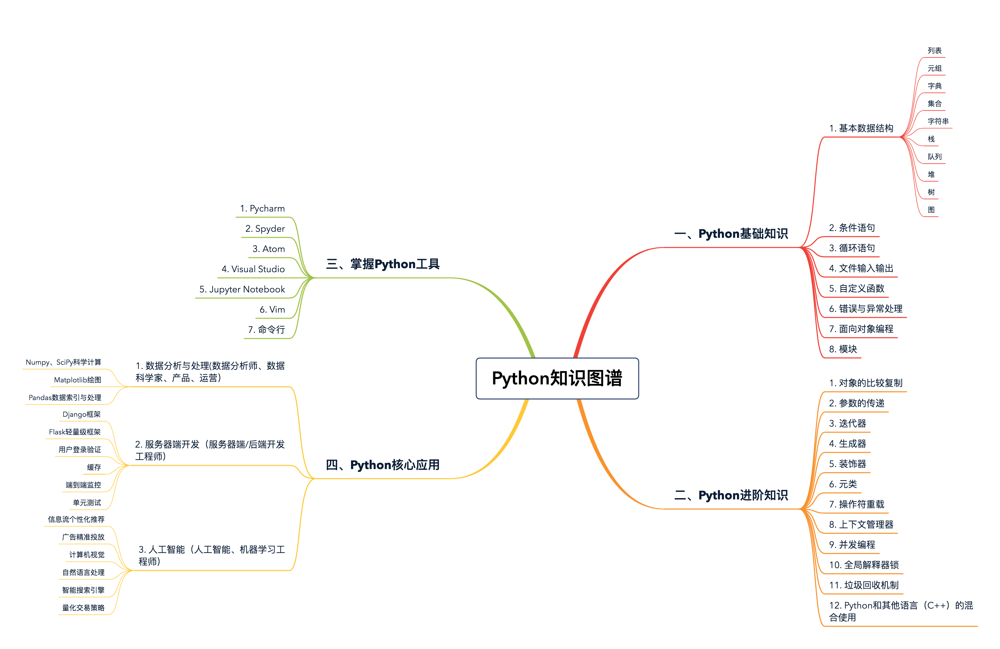
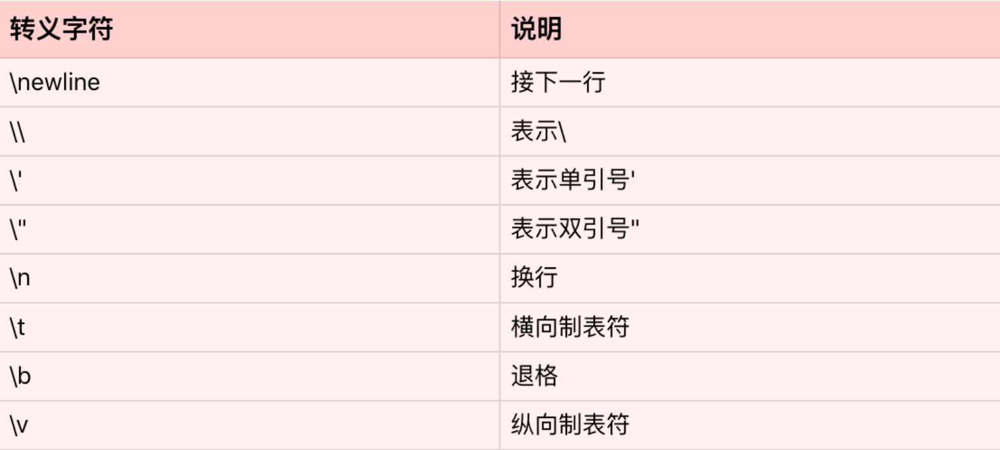

# 简介

学习心得：

- 1、从工程的角度深入理解Python，以实用为出发点，多练习、多阅读、多做项目，这样才能有质的提高。
- 2、牢牢掌握一门编程语言及其学习方法，是日后在所有领域深造的根基。不同语言，需融会贯通。
- 3、基础不牢，地动山摇。更深刻、实质的基础理解，才是更牢固的知识大厦的根基。大厦之基，勤加练习。
- 4、没上过战场开过枪的人，不可能做主官；没有实战经验的语言学习者，不可能成为高手。
- 5、对于Python的源码阅读，主要是CPython，用C写的，可能读起来比较费劲，需要一定的C基础，但是很多时候也不需要详细知道每一句话的意思，大概知道这段干什么就可以了。
- 6、代码规范，必不可少。
- 7、开发经验，质的突破。

特点：

- 1、语言简洁
- 2、开发效率高
- 3、可移植性强
- 4、可以和其他编程语言（比如 C++）轻松无缝衔接


领域：

* 1、机器学习：TensorFlow框架
* 2、人工智能的推荐排序系统与算法
* 3、数据处理
* 4、Web开发
* 5、爬虫
* 6、运维脚本

# 基础



## 列表和元组

相同点：

- 1、列表和元组，都是一个可以放置任意数据类型的有序集合。
> 在绝大多数编程语言中，集合的数据类型必须一致。不过，对于 Python 的列表和元组来说，并无此要求。
- 2、Python 中的列表和元组都支持负数索引，-1 表示最后一个元素，-2 表示倒数第二个元素，以此类推。
- 3、列表和元组都支持切片操作。
- 4、列表和元组都可以随意嵌套。
- 5、两者也可以通过`list()`和`tuple()`函数相互转换

不同点：

- 1、列表是动态的，长度大小不固定，可以随意地增加、删减或者改变元素（mutable）。
- 2、而元组是静态的，长度大小固定，无法增加删减或者改变（immutable）。

```text
count(item) 表示统计列表 / 元组中 item 出现的次数。
index(item) 表示返回列表 / 元组中 item 第一次出现的索引。

list.reverse() 和 list.sort() 分别表示原地倒转列表和排序（注意，元组没有内置的这两个
函数)。

reversed() 和 sorted() 同样表示对列表 / 元组进行倒转和排序，但是会返回一个倒转后
或者排好序的新的列表 / 元组。
```

### 列表和元组存储方式的差异

列表空间分配的过程，为了减小每次增加 / 删减操作时空间分配的开销，Python每次分配空间时都会额外多分配一些，这样的机制（`over-allocating`）保证了其操作的高效性：增加 / 删除的时间复杂度均为 O(1)。

### 列表和元组的性能
结论：**元组要比列表更加轻量级一些，所以总体上来说，元组的性能速度要略优于列表。**

list和tuple的内部实现都是array的形式。

list因为可变，所以是一个over-allocate的array，tuple因为不可变，所以长度大小固定。

具体可以参照源码list:

https://github.com/python/cpython/blob/master/Objects/listobject.c. 

tuple:

https://github.com/python/cpython/blob/master/Objects/tupleobject.c

创建一个空的列表，可以用下面的 A、B 两种方式，它们在效率上有什么区别吗？应该优先考虑使用哪种呢？
```python
# 创建空列表
# option A
empty_list = list()
# option B
empty_list = []
```
> 区别主要在于list()是一个function call，Python的function call会创建stack，并且进行一系列参
数检查的操作，比较expensive，反观[]是一个内置的C函数，可以直接被调用，因此效率高。

```shell
# 元组的初始化速度，要比列表快 5 倍。
python3 -m timeit 'x=(1,2,3,4,5,6)'
20000000 loops, best of 5: 9.97 nsec per loop
python3 -m timeit 'x=[1,2,3,4,5,6]'
5000000 loops, best of 5: 50.1 nsec per loop

# 索引操作的话，两者的速度差别非常小，几乎可以忽略不计
python3 -m timeit -s 'x=[1,2,3,4,5,6]' 'y=x[3]'
10000000 loops, best of 5: 22.2 nsec per loop
python3 -m timeit -s 'x=(1,2,3,4,5,6)' 'y=x[3]'
10000000 loops, best of 5: 21.9 nsec per loop
```

### 列表（list）

### 元组（tuple）

## 字典和集合

字典是一系列由键（key）和值（value）配对组成的元素的集合。

集合和字典基本相同，唯一的区别，就是集合没有键和值的配对，是一系列无序的、唯一的元素组合。

**Python 中字典和集合，无论是键还是值，都可以是混合类型。**

**集合并不支持索引操作，因为集合本质上是一个哈希表，和列表不一样。**

> 在 Python3.7+，字典被确定为有序（注意：在 3.6 中，字典有序是一个implementation detail，在 3.7 才正式成为语言特性，因此 3.6 中无法 100% 确保其有序性），而 3.6 之前是无序的，其长度大小可变，元素可以任意地删减和改变。

注意：
> 集合的 pop() 操作是删除集合中最后一个元素，可是集合本身是无序的，无法知道会删除哪个元素，因此这个操作得谨慎使用。

对于集合，其排序和前面讲过的列表、元组很类似，直接调用 sorted(set) 即可，结果会返回一个排好序的列表。

### 字典和集合性能

**字典和集合是进行过性能高度优化的数据结构，特别是对于查找、添加和删除操作。**

不同于其他数据结构，字典和集合的内部结构都是一张哈希表。
> 对于字典而言，这张表存储了哈希值（hash）、键和值这 3 个元素。
> 而对集合来说，区别就是哈希表内没有键和值的配对，只有单一的元素了。


初始化字典的方式，哪一种更高效？
```python
# Option A
d = {'name': 'jason', 'age': 20, 'gender': 'male'}
# Option B
d = dict({'name': 'jason', 'age': 20, 'gender': 'male'})
```
> 直接使用大括号更高效，直接调用C函数。

字典的键可以是一个列表吗？下面这段代码中，字典的初始化是否正确呢？
```python
d = {'name': 'jason', ['education']: ['Tsinghua University', 'Stanford University']}
```
> 列表不可以作为key，因为列表是可变类型，可变类型不可hash。


### 字典

哈希冲突（`hash collision`）


### 集合

## 字符串

字符串是由独立字符组成的一个序列，通常包含在单引号（''）双引号（""）或者三引号之中（''' '''或""" """，两者一样）

三引号字符串，则主要应用于多行字符串的情境，比如函数的注释等等。
```python
def calculate_similarity(item1, item2):
    """
    Calculate similarity between two items
    Args:
    item1: 1st item
    item2: 2nd item
    Returns:
    similarity score between item1 and item2
    """
    pass
```

Python 也支持转义字符。


可以把字符串想象成一个由单个字符组成的数组，所以，Python 的字符串同样支持索引，切片和遍历等等操作。

和其他数据结构，如列表、元组一样，字符串的索引同样从 0 开始，index=0 表示第一个元素（字符），[index:index+2] 则表示第 index 个元素到 index+1 个元素组成的子字符串。

**Python 的字符串是不可变的（immutable）。**
```python
s = 'hello'
s[0] = 'H'
Traceback (most recent call last):
File "<stdin>", line 1, in <module>
TypeError: 'str' object does not support item assignment
```

每次想要改变字符串，往往需要 O(n) 的时间复杂度，其中，n 为新字符串的长度。

操作符'+='的字符串拼接方法。是一个例外，打破了字符串不可变的特性。

`str1 += str2 # 表示 str1 = str1 + str2`

自从 Python2.5 开始，每次处理字符串的拼接操作时（str1 += str2），Python 首先会检测 str1 还有没有其他的引用。如果没有的话，就会尝试原地扩充字符串 buffer 的大小，而不是重新分配一块内存来创建新的字符串并拷贝。

```text
字符串内置的 join 函数
`string.join(iterable)，表示把每个元素都按照指定的格式连接起来。`
string.split(str)，分割字符串；
string.strip(str)，表示去掉首尾的 str 字符串；
string.lstrip(str)，表示只去掉开头的 str 字符串；
string.rstrip(str)，表示只去掉尾部的 str 字符串。
string.find(sub, start, end)，表示从start 到 end 查找字符串中子字符串 sub 的位置
```

在新版本的 Python（2.5+）中，下面的两个字符串拼接操作，你觉得哪个更优呢？
```python
s = ''
for n in range(0, 100000):
    s += str(n)

l = []
for n in range(0, 100000):
    l.append(str(n))
s = ' '.join(l)
```
> += 每次都会扩容，而 [] 不会每次扩容
> 如果字符串拼接的次数较少，比如range(100)，那么方法一更优，因为时间复杂度精确的来说第一种是O(n)，第二种是O(2^n)，如果拼接的次数较多，比如range(1000000)，方法二稍快一些，虽然方法二会遍历两次，但是join的速度其实很快，列表append和join的开销要比字符串+=小一些。


### 字符串的格式化

`string.format()`

`%s`

str.format格式相对好一些，但参数多了或者处理更长字符串时还是冗长。
f-string这种方式可以更加简化表达过程。还支持大小写（f.或者F.）

## 输入和输出

### 输入

来自键盘操作

`input()` 函数暂停程序运行，同时等待键盘输入；直到回车被按下，函数的参数即为提示语，输入的类型永远是字符串型（str）。

```python
a = input()
1
b = input()
2
print('a + b = {}'.format(a + b))
########## 输出 ##############
a + b = 12
print('type of a is {}, type of b is {}'.format(type(a), type(b)))
########## 输出 ##############
type of a is <class 'str'>, type of b is <class 'str'>

print('a + b = {}'.format(int(a) + int(b)))
########## 输出 ##############
a + b = 3
```

**Python 对 int 类型没有最大限制**


### 输出


# 进阶

# 规范


# 问题

## Python中循环结构while和for谁的效率高呢？

代码中所有直接调用C的操作的语句肯定比通过Python间接调用C（Python的解释器是C写的）快的多。

比如下面的例子：B用for循环比例子A用while循环快很多。

因为range这个函数是C写的，直接调用。但是i += 1这个操作得通过解释器间接调用C，而这个简单的增值操作又涉及到object的创建和删除（i是immutable的），因此相对来说很耽误时间。

```python
# (A)
i = 0
while i < 100000000:
    i += 1
# (B)
for i in range(0, 100000000):
    pass
```


# 模块

## dis分析字节码


## timeit 模块

`python3 -m timeit` 
> 是 Python 的一个命令行工具，用于测量小段代码的执行时间。它属于 Python 标准库中的 timeit 模块，专门用于简单、快速的性能测试。这个工具特别适合比较不同实现方式的性能差异。

shell中用法：`python3 -m timeit "your_code"`

注意：Windows 通常直接使用 python 而不是 python3
cmd用法：`python -m timeit "your_code"`

由于 Windows 命令行的语法规则（特别是引号的处理）与 Unix/Linux 有所不同，可能会遇到一些问题。
特殊注意事项
- 1、引号规则不同：
> 如果代码中包含双引号 "，需要：外层用单引号 ' 包裹或者用转义双引号 \"
- 2、避免特殊字符：
> 如果代码中包含 |、> 等 Windows 特殊字符，建议用单引号包裹或转义。


常用参数：
```shell
-n N：设置每次测试运行的次数（默认自动调整）

-r N：设置重复测试的轮数（默认 5 轮）

-s SETUP 或 --setup=SETUP：设置初始化代码（只执行一次）

-p 或 --process：测量进程时间而非 wall time
```

测试列表推导式的速度：
`python3 -m timeit "[x*x for x in range(100)]"`

带初始化代码的测试：
`python3 -m timeit -s "arr=list(range(1000))" "sum(arr)"`

自定义运行参数：
`python3 -m timeit -n 1000 -r 3 "sorted(list(range(100)))"`

输出解读：
> 100000 loops, best of 5: 1.23 usec per loop
表示：系统自动选择了运行 100,000 次，5 轮测试中最好的结果是每次循环 1.23 微秒

注意事项：
- 1、测试的代码需要用引号包裹
- 2、避免测试太快的操作（可能得到不准确的结果）
- 3、对于复杂测试，建议先用 -s 设置初始化代码

也可以在 Python 脚本中使用这个模块
```python
import timeit
timeit.timeit('"-".join(str(n) for n in range(100))', number=10000)
```
